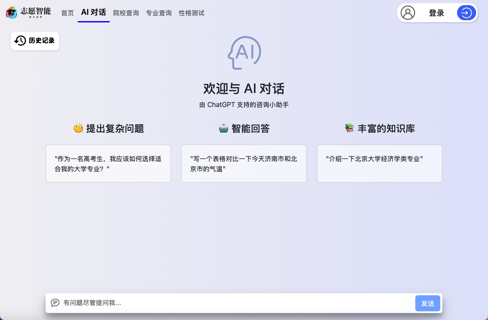
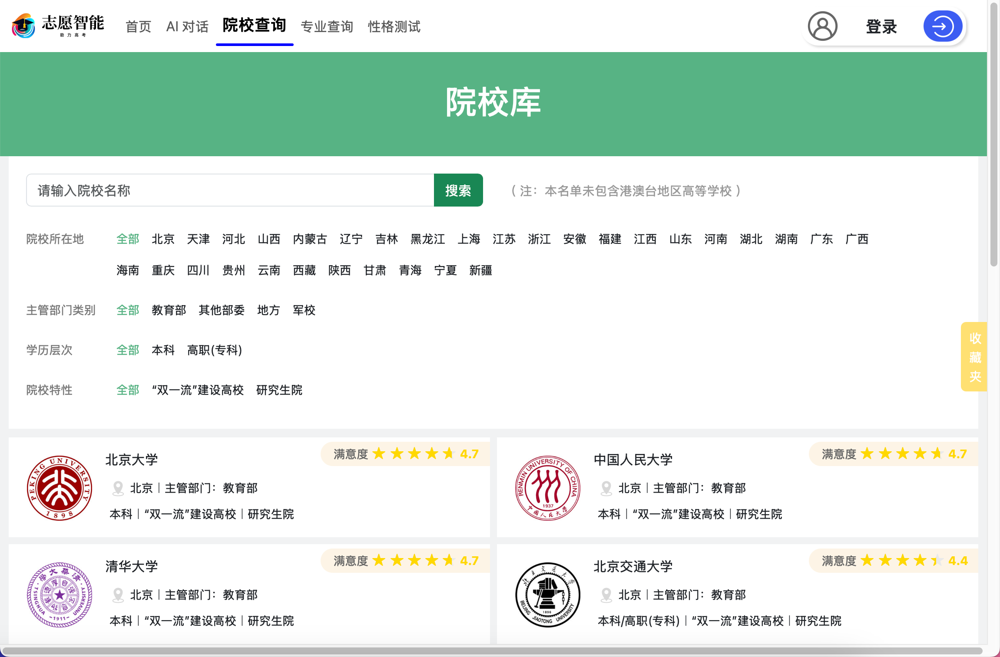
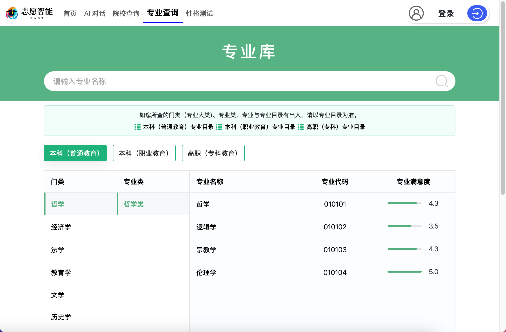
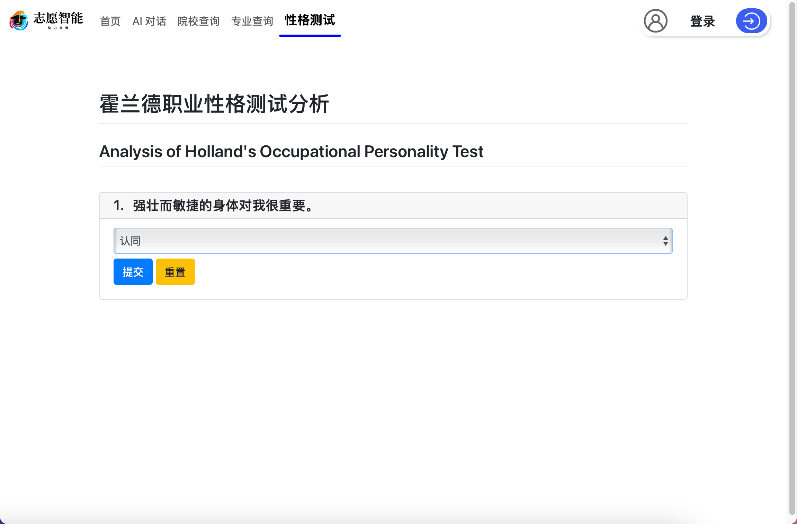

## 项目介绍

本项目具有以下几个板块：AI智选、院校查询、专业查询、成绩查询、霍兰德职业性格测试。AI智选板块通过OpenAI api接口与AI对话，AI会通过数据库数据向用户推荐院校，以及查询天气等附属功能，使用sse流式传输，具有完善的用户界面，例如历史记录功能，停止响应等操作。

完整数据库下载地址：```https://drive.google.com/file/d/1KMd7RxtIXXMoXA3IoZWjspynJSFxRd7X/view?usp=share_link```










## 部署网站

1. 进入项目文件夹

    ```shell
    cd Gaokao_WebSite
    ```

### 使用Docker Compose部署

1. 构建镜像

   ```shell
   docker build --pull --rm -f "Dockerfile" -t intellichoice:latest "."
   ```

2. 拉取依赖镜像

   ```shell
   docker pull mysql
   docker pull redis
   ```

3. 使用Docker Compose部署容器

   ```shell
   docker compose  -f "docker-compose.yml" up -d --build mysql redis IntelliChoice
   ```

4.  等待Mysql数据导入完成后即可访问 <http://localhost:8080>

### 直接部署

1. 安装Python3.8(或更新版本) MySQL8 Redis

2. 启动MySql和Redis，在server/jdbc.py第4—8行修改mysql地址、端口、用户名、密码、数据库名信息；在server/server.py中第21行修改redis地址。

3. 解压data/IntelliChoice_DB.sql.gz文件，在MySql中创建名为 `gaokao_DB` 的数据库并执行sql文件导入数据

4. 安装Python依赖

   ```shell
   pip install -r requriements.txt
   ```

5. 导入环境变量

   ```shell
   export PYTHONPATH=./server
   ```

6. 使用AI智选，需在server/chatgpt.py第6-9行添加密钥，或直接在环境变量中添加```OPENAI_API_BASE``` ```OPENAI_API_KEY```

   ```python
   client = OpenAI(
       api_key="",	// API密钥
       base_url="",	// API地址 e.g. https://api.openai.com
   )
   ```

7. 使用天气查询，需在server/weather.py第4行添加和风天气密钥

   ```python
   qweather_key = ""
   ```

8. 启动服务

   - 开发请使用以下命令启动服务

     ```shell
     python3 server/main.py		//以开发环境启动服务
     ```

     访问 <http://localhost:5100>

   - 部署请使用以下命令启动服务

     ```shell
     export PYTHONPATH=./server										//导入环境变量
     waitress-serve --listen='*:8080' main:app		//在8080端口以生产环境启动服务
     ```
     
     访问 <http://localhost:8080>
